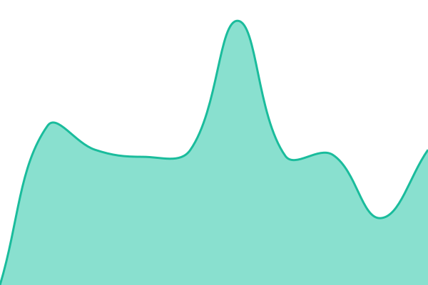
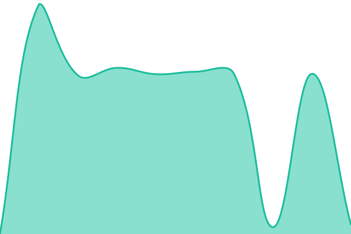
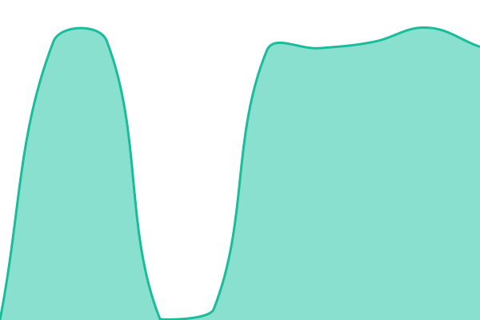
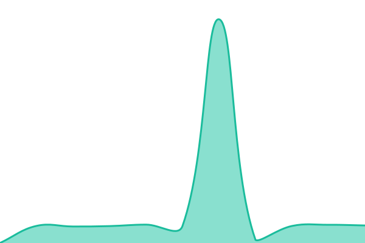
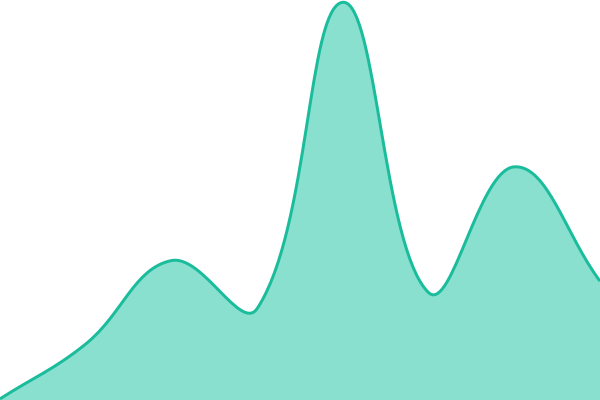
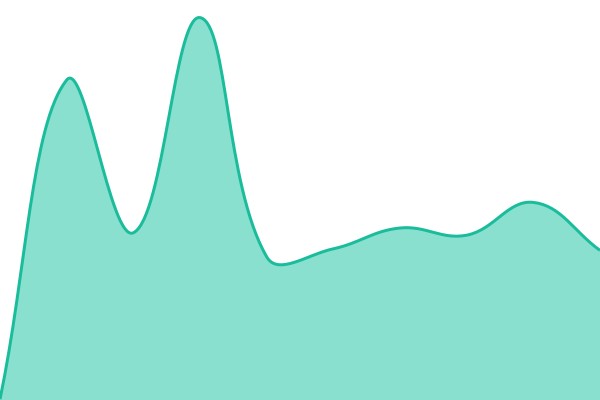
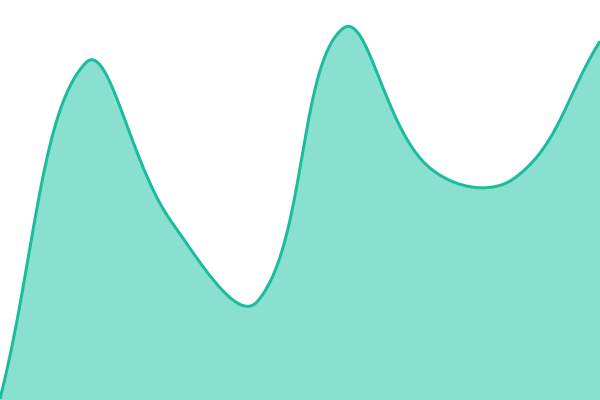

# [📈 Live Status](https://status.calcofi.io): <!--live status--> **🟩 All systems operational**

This repository contains the open-source uptime monitor and status page for [CalCOFI](https://calcofi.io), powered by [Upptime](https://github.com/upptime/upptime).

With [Upptime](https://upptime.js.org), you can get your own unlimited and free uptime monitor and status page, powered entirely by a GitHub repository. We use [Issues](https://github.com/CalCOFI/uptime/issues) as incident reports, [Actions](https://github.com/CalCOFI/uptime/actions) as uptime monitors, and [Pages](https://status.calcofi.io) for the status page.

<!--start: status pages-->
<!-- This summary is generated by Upptime (https://github.com/upptime/upptime) -->
<!-- Do not edit this manually, your changes will be overwritten -->
<!-- prettier-ignore -->
| URL | Status | History | Response Time | Uptime |
| --- | ------ | ------- | ------------- | ------ |
|  [Oceano app](https://app.calcofi.io/oceano/) | 🟩 Up | [oceano-app.yml](https://github.com/CalCOFI/uptime/commits/HEAD/history/oceano-app.yml) | 

 10808ms
     
 | 

<a href="https://status.calcofi.io/history/oceano-app">99.80%</a>
    

|  [CTD app](https://app.calcofi.io/ctd/) | 🟩 Up | [ctd-app.yml](https://github.com/CalCOFI/uptime/commits/HEAD/history/ctd-app.yml) | 

 11302ms
     
 | 

<a href="https://status.calcofi.io/history/ctd-app">100.00%</a>
    

|  [Datacheck app](https://app.calcofi.io/datacheck/) | 🟩 Up | [datacheck-app.yml](https://github.com/CalCOFI/uptime/commits/HEAD/history/datacheck-app.yml) | 

 11537ms
     
 | 

<a href="https://status.calcofi.io/history/datacheck-app">100.00%</a>
    

|  [Dashboard app](https://app.calcofi.io/dashboard/) | 🟩 Up | [dashboard-app.yml](https://github.com/CalCOFI/uptime/commits/HEAD/history/dashboard-app.yml) | 

 4593ms
     
 | 

<a href="https://status.calcofi.io/history/dashboard-app">100.00%</a>
    

|  [Copernicus app](https://app.calcofi.io/copernicus/) | 🟩 Up | [copernicus-app.yml](https://github.com/CalCOFI/uptime/commits/HEAD/history/copernicus-app.yml) | 

 11086ms
     
 | 

<a href="https://status.calcofi.io/history/copernicus-app">100.00%</a>
    

|  [Integrated app](https://app.calcofi.io/int/) | 🟩 Up | [integrated-app.yml](https://github.com/CalCOFI/uptime/commits/HEAD/history/integrated-app.yml) | 

 15907ms
     
 | 

<a href="https://status.calcofi.io/history/integrated-app">100.00%</a>
    

|  [MarMam app](https://app.calcofi.io/marmam/) | 🟩 Up | [mar-mam-app.yml](https://github.com/CalCOFI/uptime/commits/HEAD/history/mar-mam-app.yml) | 

 2834ms
     
 | 

<a href="https://status.calcofi.io/history/mar-mam-app">100.00%</a>
    

|  [Pollutants app](https://app.calcofi.io/pollutants/) | 🟩 Up | [pollutants-app.yml](https://github.com/CalCOFI/uptime/commits/HEAD/history/pollutants-app.yml) | 

 3821ms
     
 | 

<a href="https://status.calcofi.io/history/pollutants-app">100.00%</a>
    

|  [SaferSeafood app](https://app.calcofi.io/SaferSeafood/) | 🟩 Up | [safer-seafood-app.yml](https://github.com/CalCOFI/uptime/commits/HEAD/history/safer-seafood-app.yml) | 

 15901ms
     
 | 

<a href="https://status.calcofi.io/history/safer-seafood-app">100.00%</a>
    

|  [Capstone app](https://app.calcofi.io/capstone/) | 🟩 Up | [capstone-app.yml](https://github.com/CalCOFI/uptime/commits/HEAD/history/capstone-app.yml) | 

 22066ms
     
 | 

<a href="https://status.calcofi.io/history/capstone-app">100.00%</a>
    

|  [Shiny server](https://app.calcofi.io/) | 🟩 Up | [shiny-server.yml](https://github.com/CalCOFI/uptime/commits/HEAD/history/shiny-server.yml) | 

 184ms
     
 | 

<a href="https://status.calcofi.io/history/shiny-server">100.00%</a>
    

|  [Tile server](https://tile.calcofi.io/index.json) | 🟩 Up | [tile-server.yml](https://github.com/CalCOFI/uptime/commits/HEAD/history/tile-server.yml) | 

 223ms
     
 | 

<a href="https://status.calcofi.io/history/tile-server">100.00%</a>
    

|  [File server](https://file.calcofi.io/) | 🟩 Up | [file-server.yml](https://github.com/CalCOFI/uptime/commits/HEAD/history/file-server.yml) | 

 210ms
     
 | 

<a href="https://status.calcofi.io/history/file-server">100.00%</a>
    

|  [Home website](https://calcofi.io/) | 🟩 Up | [home-website.yml](https://github.com/CalCOFI/uptime/commits/HEAD/history/home-website.yml) | 

 413ms
     
 | 

<a href="https://status.calcofi.io/history/home-website">100.00%</a>
    

<!--end: status pages-->

[**Visit our status website →**](https://status.calcofi.io)

## 📄 License

- Powered by: [Upptime](https://github.com/upptime/upptime)
- Code: [MIT](./LICENSE) © [Anand Chowdhary](https://anandchowdhary.com)
- Data in the `./history` directory: [Open Database License](https://opendatacommons.org/licenses/odbl/1-0/)
