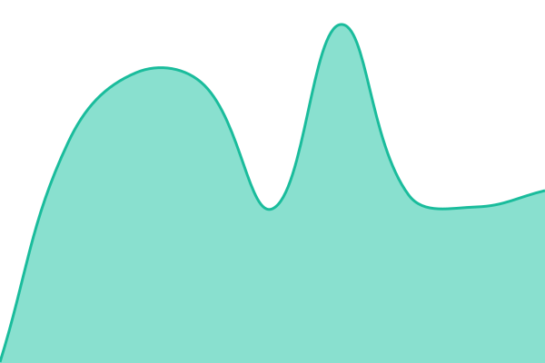
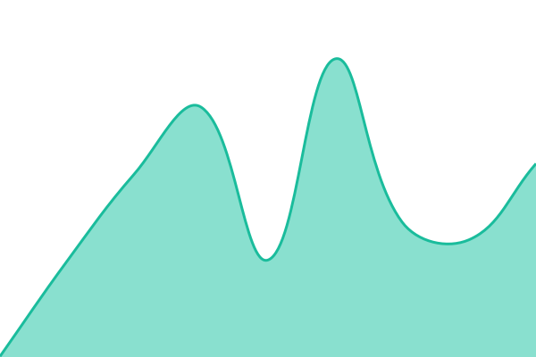
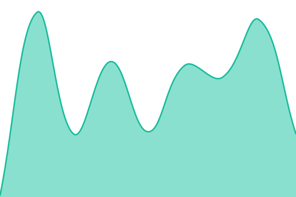
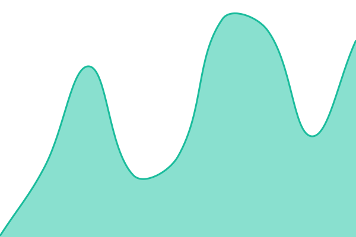
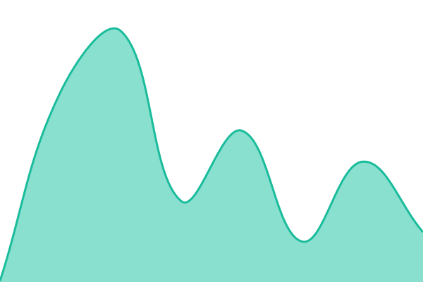
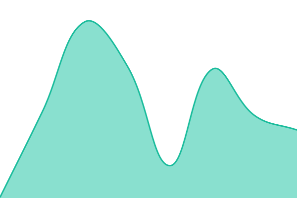
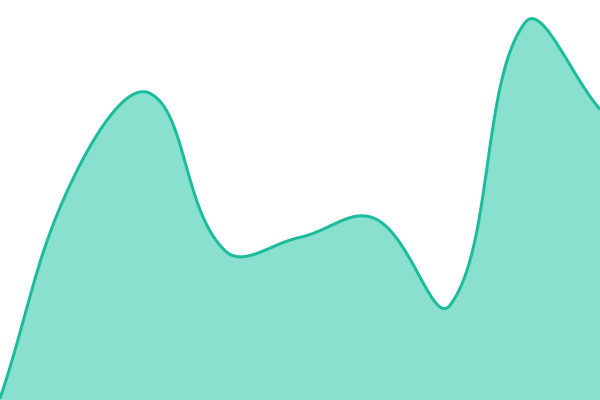
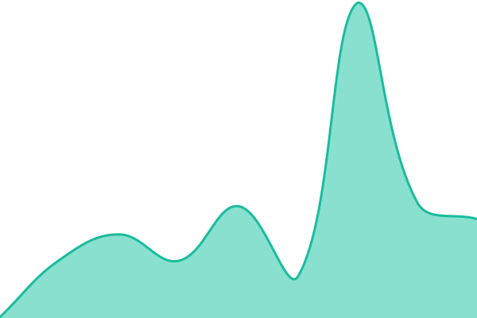
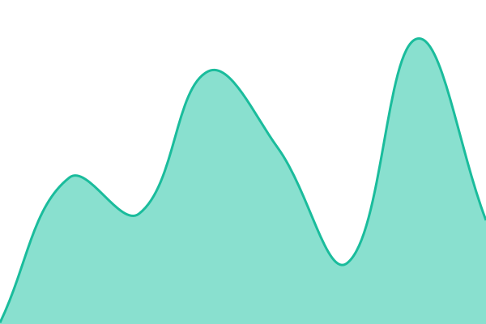
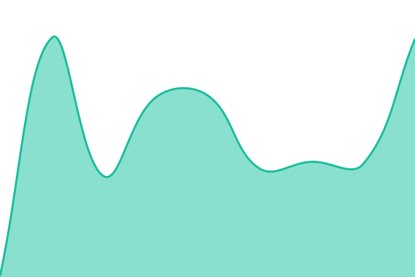

# [📈 Live Status](https://status.calcofi.io): <!--live status--> **🟩 All systems operational**

This repository contains the open-source uptime monitor and status page for [CalCOFI](https://calcofi.io), powered by [Upptime](https://github.com/upptime/upptime).

With [Upptime](https://upptime.js.org), you can get your own unlimited and free uptime monitor and status page, powered entirely by a GitHub repository. We use [Issues](https://github.com/CalCOFI/uptime/issues) as incident reports, [Actions](https://github.com/CalCOFI/uptime/actions) as uptime monitors, and [Pages](https://status.calcofi.io) for the status page.

<!--start: status pages-->
<!-- This summary is generated by Upptime (https://github.com/upptime/upptime) -->
<!-- Do not edit this manually, your changes will be overwritten -->
<!-- prettier-ignore -->
| URL | Status | History | Response Time | Uptime |
| --- | ------ | ------- | ------------- | ------ |
|  [db-viz-hex](https://app.calcofi.io/hex/) | 🟩 Up | [db-viz-hex.yml](https://github.com/CalCOFI/uptime/commits/HEAD/history/db-viz-hex.yml) | 

 13353ms
     
 | 

<a href="https://status.calcofi.io/history/db-viz-hex">100.00%</a>
    

|  [db-viz-cruise](https://app.calcofi.io/cruise/) | 🟩 Up | [db-viz-cruise.yml](https://github.com/CalCOFI/uptime/commits/HEAD/history/db-viz-cruise.yml) | 

 11023ms
     
 | 

<a href="https://status.calcofi.io/history/db-viz-cruise">100.00%</a>
    

|  [ctd-viz](https://app.calcofi.io/ctd/) | 🟩 Up | [ctd-viz.yml](https://github.com/CalCOFI/uptime/commits/HEAD/history/ctd-viz.yml) | 

 11781ms
     
 | 

<a href="https://status.calcofi.io/history/ctd-viz">100.00%</a>
    

|  [pollutants](https://app.calcofi.io/pollutants/) | 🟩 Up | [pollutants.yml](https://github.com/CalCOFI/uptime/commits/HEAD/history/pollutants.yml) | 

 10669ms
     
 | 

<a href="https://status.calcofi.io/history/pollutants">100.00%</a>
    

|  [marmam](https://app.calcofi.io/marmam/) | 🟩 Up | [marmam.yml](https://github.com/CalCOFI/uptime/commits/HEAD/history/marmam.yml) | 

 2870ms
     
 | 

<a href="https://status.calcofi.io/history/marmam">100.00%</a>
    

|  [saferseafood](https://app.calcofi.io/SaferSeafood/) | 🟩 Up | [saferseafood.yml](https://github.com/CalCOFI/uptime/commits/HEAD/history/saferseafood.yml) | 

 15334ms
     
 | 

<a href="https://status.calcofi.io/history/saferseafood">100.00%</a>
    

|  [capstone](https://app.calcofi.io/capstone/) | 🟩 Up | [capstone.yml](https://github.com/CalCOFI/uptime/commits/HEAD/history/capstone.yml) | 

 22195ms
     
 | 

<a href="https://status.calcofi.io/history/capstone">100.00%</a>
    

|  [ucsb-larvae-dashboard](https://app.calcofi.io/2026-ucsb-larvae-dashboard/) | 🟩 Up | [ucsb-larvae-dashboard.yml](https://github.com/CalCOFI/uptime/commits/HEAD/history/ucsb-larvae-dashboard.yml) | 

 3235ms
     
 | 

<a href="https://status.calcofi.io/history/ucsb-larvae-dashboard">100.00%</a>
    

|  [erddap](https://erddap.calcofi.io/erddap/index.html) | 🟩 Up | [erddap.yml](https://github.com/CalCOFI/uptime/commits/HEAD/history/erddap.yml) | 

 294ms
     
 | 

<a href="https://status.calcofi.io/history/erddap">100.00%</a>
    

|  [storage](https://storage.calcofi.io/) | 🟩 Up | [storage.yml](https://github.com/CalCOFI/uptime/commits/HEAD/history/storage.yml) | 

 270ms
     
 | 

<a href="https://status.calcofi.io/history/storage">100.00%</a>
    

|  [datasets](https://calcofi.io/datasets/) | 🟩 Up | [datasets.yml](https://github.com/CalCOFI/uptime/commits/HEAD/history/datasets.yml) | 

 246ms
     
 | 

<a href="https://status.calcofi.io/history/datasets">100.00%</a>
    

|  [explore](https://calcofi.io/explore/) | 🟩 Up | [explore.yml](https://github.com/CalCOFI/uptime/commits/HEAD/history/explore.yml) | 

 156ms
     
 | 

<a href="https://status.calcofi.io/history/explore">100.00%</a>
    

|  [ctd-transects](https://calcofi.io/ctd-transects/) | 🟩 Up | [ctd-transects.yml](https://github.com/CalCOFI/uptime/commits/HEAD/history/ctd-transects.yml) | 

 150ms
     
 | 

<a href="https://status.calcofi.io/history/ctd-transects">100.00%</a>
    

|  [db-viz-station](https://app.calcofi.io/station/) | 🟩 Up | [db-viz-station.yml](https://github.com/CalCOFI/uptime/commits/HEAD/history/db-viz-station.yml) | 

 282ms
     
 | 

<a href="https://status.calcofi.io/history/db-viz-station">100.00%</a>
    

|  [db-query](https://calcofi.io/db-query/) | 🟩 Up | [db-query.yml](https://github.com/CalCOFI/uptime/commits/HEAD/history/db-query.yml) | 

 143ms
     
 | 

<a href="https://status.calcofi.io/history/db-query">100.00%</a>
    

|  [db-schema](https://calcofi.io/db-schema/) | 🟩 Up | [db-schema.yml](https://github.com/CalCOFI/uptime/commits/HEAD/history/db-schema.yml) | 

 142ms
     
 | 

<a href="https://status.calcofi.io/history/db-schema">100.00%</a>
    

|  [workflows](https://calcofi.io/workflows/) | 🟩 Up | [workflows.yml](https://github.com/CalCOFI/uptime/commits/HEAD/history/workflows.yml) | 

 137ms
     
 | 

<a href="https://status.calcofi.io/history/workflows">100.00%</a>
    

|  [docs](https://calcofi.io/docs/) | 🟩 Up | [docs.yml](https://github.com/CalCOFI/uptime/commits/HEAD/history/docs.yml) | 

 134ms
     
 | 

<a href="https://status.calcofi.io/history/docs">100.00%</a>
    

|  [calcofi4r](https://calcofi.io/calcofi4r/) | 🟩 Up | [calcofi4r.yml](https://github.com/CalCOFI/uptime/commits/HEAD/history/calcofi4r.yml) | 

 235ms
     
 | 

<a href="https://status.calcofi.io/history/calcofi4r">100.00%</a>
    

|  [calcofi4db](https://calcofi.io/calcofi4db/) | 🟩 Up | [calcofi4db.yml](https://github.com/CalCOFI/uptime/commits/HEAD/history/calcofi4db.yml) | 

 144ms
     
 | 

<a href="https://status.calcofi.io/history/calcofi4db">100.00%</a>
    

|  [calcofi4py](https://calcofi.io/calcofi4py/) | 🟩 Up | [calcofi4py.yml](https://github.com/CalCOFI/uptime/commits/HEAD/history/calcofi4py.yml) | 

 148ms
     
 | 

<a href="https://status.calcofi.io/history/calcofi4py">100.00%</a>
    

|  [ucla-monitoring-map](https://calcofi.io/2026-ucla-cal-ocean-coastal-monitoring-map/) | 🟩 Up | [ucla-monitoring-map.yml](https://github.com/CalCOFI/uptime/commits/HEAD/history/ucla-monitoring-map.yml) | 

 169ms
     
 | 

<a href="https://status.calcofi.io/history/ucla-monitoring-map">100.00%</a>
    

|  [ucsb-station-portal](https://calcofi.io/2026-ucsb-station-data-portal/) | 🟩 Up | [ucsb-station-portal.yml](https://github.com/CalCOFI/uptime/commits/HEAD/history/ucsb-station-portal.yml) | 

 116ms
     
 | 

<a href="https://status.calcofi.io/history/ucsb-station-portal">100.00%</a>
    

|  [hypoxia-story](https://calcofi.io/hypoxia-story/) | 🟩 Up | [hypoxia-story.yml](https://github.com/CalCOFI/uptime/commits/HEAD/history/hypoxia-story.yml) | 

 148ms
     
 | 

<a href="https://status.calcofi.io/history/hypoxia-story">100.00%</a>
    

|  [shiny-server](https://app.calcofi.io/) | 🟩 Up | [shiny-server.yml](https://github.com/CalCOFI/uptime/commits/HEAD/history/shiny-server.yml) | 

 182ms
     
 | 

<a href="https://status.calcofi.io/history/shiny-server">100.00%</a>
    

|  [file-server](https://file.calcofi.io/) | 🟩 Up | [file-server.yml](https://github.com/CalCOFI/uptime/commits/HEAD/history/file-server.yml) | 

 257ms
     
 | 

<a href="https://status.calcofi.io/history/file-server">100.00%</a>
    

|  [db-backup](https://file.calcofi.io/status/pg_backup.ok) | 🟩 Up | [db-backup.yml](https://github.com/CalCOFI/uptime/commits/HEAD/history/db-backup.yml) | 

 191ms
     
 | 

<a href="https://status.calcofi.io/history/db-backup">100.00%</a>
    

|  [home-website](https://calcofi.io/) | 🟩 Up | [home-website.yml](https://github.com/CalCOFI/uptime/commits/HEAD/history/home-website.yml) | 

 186ms
     
 | 

<a href="https://status.calcofi.io/history/home-website">100.00%</a>
    

<!--end: status pages-->

[**Visit our status website →**](https://status.calcofi.io)

## 📄 License

- Powered by: [Upptime](https://github.com/upptime/upptime)
- Code: [MIT](./LICENSE) © [Anand Chowdhary](https://anandchowdhary.com)
- Data in the `./history` directory: [Open Database License](https://opendatacommons.org/licenses/odbl/1-0/)
